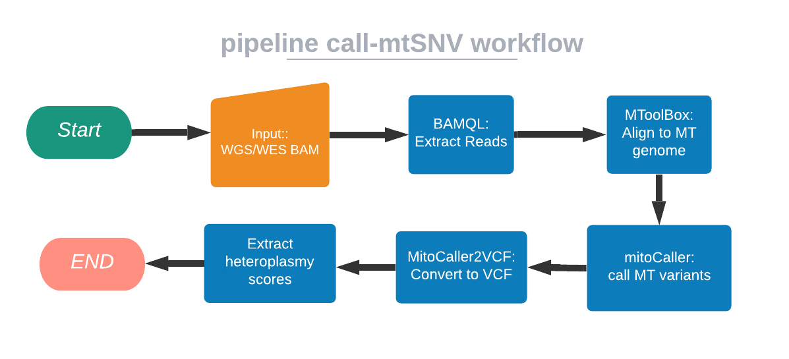
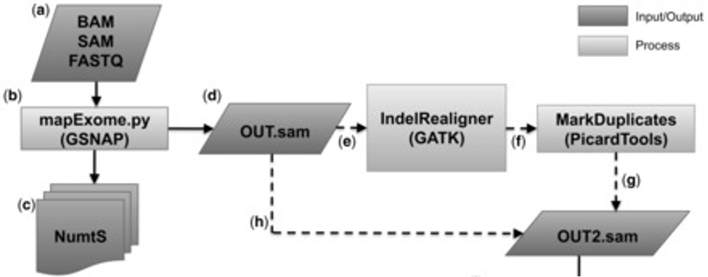

# Boutros Lab call-mtSNV pipeline

 [Boutros Lab call-mtSNV pipeline](#Boutros-Lab-call-mtSNV-pipeline)
  - [Overview](#overview)
  - [How To Run](#how-to-run)
  - [Flow Diagram](#flow-diagram)
  - [Pipeline Steps](#pipeline-steps)
     - [1. Extract mtDNA with BAMQL](#1-Extract-mtDNA-with-BAMQL)
     - [2. Align mtDNA with MToolBox](#2-Align-mtDNA-with-MToolBox)
     - [3. Call mtSNV with mitoCaller](#3-Call-mtSNV-with-mitoCaller)
     - [4. Convert mitoCaller output with Mito2VCF](#4-Convert-mitoCaller-output-with-Mito2VCF)
     - [5. Call Heteroplasmy on Paired Samples](#5-Call-Heteroplasmy-on-Paired-Samples)
  - [Inputs](#inputs)
  - [Outputs](#outputs)
  - [Testing and Validation](#testing-and-validation)
    - [Test Data Set](#test-data-set)
    - [Validation ](#validation-version-number)
    - [Validation Tool](#validation-tool)
  - [References](#references)
  - [License](#license) 

## Overview
This nextflow pipeline takes as input either a single aligned BAM or a pair of normal tumor bams,  and extracts mitochondrial DNA reads, remaps the reads to a mitochondrial reference genome, and subsequently calls variants. It can use be used in single sample and tumor-normal paired mode. Paired mode gives an addtional heteroplasmy comparison.
___

## How To Run
Samples can be run by specifying file locations in the *input.csv and pipeline-specific paramaters in the call-mtSNV.config:

#### call-mtSNV_input.csv
This input CSV requires 3 arguments in single mode, 6 in paired. For reference look at [Inputs](#inputs)
1. normal or tumour
2. sample name
3. BAM file path

#### call-mtSNV.config
The config file requires 10 arguments
|| Input Parameter | Required | Type | Description |
|:---|:----------------|:---------|:-----|:----------------------------|
| 1 | `run_name` | yes | string | This is the overall run name, useful in paired sample mode for organizing outputs. The outputs will be housed in a directory with this name + date information automatically pulled from the system. |
| 2 | `sample_mode` | yes | string | 'single' or 'paired'? |
| 3 | `input_csv` | yes | path | Absolute path to tcall-mtSNV_input.csv |
| 4 | `output_dir` | yes | path | Absolute path to location of outputs. |
| 6 | `mt_ref_genome_dir` | yes | path | Absolute path to directory containing mitochondrial ref genome and mt ref genome index files. Take a look at the example config for location of a reference if in need of one and copy it. Alternatively, it can be found on cluster directory with reference genomes.  |
| 7 | `gmapdb` | yes | path | Absolute path to to gmapdb directory. Take a look at the example config for location of a reference if in need on and copy it. Alternatively, it can be found on cluster directory with reference genomes.|
| 8 | `save_intermediate_files` | yes | boolean | Save intermediate files. If yes, not only the final BAM, but also the unmerged, unsorted, and duplicates unmarked BAM files will also be saved. Default is set to false. |
| 9 | `cache_intermediate_pipeline_steps` | yes | boolean | Enable cahcing to resume pipeline and the end of the last successful process completion when a pipeline fails (if true the default submission script must be modified). Default is set to false.
| 10 | `sge_scheduler` | only on sge | boolean | If running on SGE or externally as a collaborator, depending on your permission settings you will need to change "sge_scheduler" to "true" |
| 11 | `ucla_cds` | only at UCLA | boolean | If running within UCLA's CDS clusters and wanto toapply optimized UCLA specific memory configurations. |
| 12 | `work_dir` | optional | path | Path of working directory for Nextflow. When included in the sample config file, Nextflow intermediate files and logs will be saved to this directory. With ucla_cds, the default is `/scratch` and should only be changed for testing/development. Changing this directory to `/hot` or `/tmp` can lead to high server latency and potential disk space limitations, respectively. |
___

## Flow Diagram

___
## Pipeline Steps

### 1. Extract mtDNA with BAMQL

BAMQL is a package or query language which the Boutros lab [published](https://doi.org/10.1186/s12859-016-1162-y) and is dedicated to extracting reads from BAM files.1-2 

### 2. Align mtDNA with MToolBox

So once we have mitochondrial reads extracted we proceed to MtoolBox which can accept as input raw data or prealigned reads. 3

In both cases, reads are mapped/remapped by the mapExome.py script to a mitochondrial reference genome. The current pipeline uses the Reconstructed Sapiens Reference Sequence (RSRS). Additional information found [here](https://haplogrep.i-med.ac.at/2014/09/08/rcrs-vs-rsrs-vs-hg19/)4

This step generates a dataset of reliable mitochondrial aligned reads.

### 3. Call mtSNV with mitoCaller

While human diploid cells have two copies of each chromosome, human cells can have a varying quantity of mtDNA ranging from 100-10,000 seperate copies. Moreover, mtDNA is circular and it is possible to have heterogeneity at the same base within the mtDNA DNA in the same cell. This means that the general approaches used for variant calling in nuclear DNA must be modified to take in these additional parameters. 

[mitoCaller](https://doi.org/10.1371/journal.pgen.1005306) is a is a script which uses a mitochondria specific algorithm to identify mtDNA variants. 5-6 Further literature on the likelihood-based mode, how circularity is handled, and how mtDNA copy number is estimated can be found [here](https://doi.org/10.1371/journal.pgen.1005306)

### 4. Convert mitoCaller output with Mito2VCF

mitoCaller2VCF converts results from mitoCaller to VCF format as the output of mitoCaller is a TSV file and must be processed to increase legibility.5

### 5. Call Heteroplasmy on Paired Samples

Heteroplasmy is the presence of more than one type of organellar genome (mitochondrial DNA or plastid DNA) within a cell or individual. This script compares heteroplasmy using the normal sample as a reference point.

## Inputs

>The input CSV must have all columns below and in the same order. Input are aligned BAM files. Sample input file can be found [here](https://github.com/uclahs-cds/pipeline-call-mtSNV/blob/Alfredo-dev/inputs/call-mtSNV_input.csv)

| Field | Type | Description |
|:------|:-----|:----------------------------|
| sample_input_1_type | string | Need to specify "normal" or "tumor". |
| sample_input_1_name | string | Name of sample. This is the name that will be used for file name outputs. Note- do not include a file extension in the name. |
| sample_input_1_path | path | Absolute path to input BAM file. |
| sample_input_2_type | string | Need to specify "normal" or "tumor". |
| sample_input_2_name | string | Name of sample. This is the name that will be used for file name outputs. Note- do not include a file extension in the name. |
| sample_input_2_path | path | Absolute path to input BAM file. |
___

## Outputs

|Process| Output | category| Description |
|:------|:--------|:--------|:----------------|
|extract_mtDNA_BAMQL|*OUT2-sorted.bam|main|Outputs Bam file with only mitochondrial reads|
|align_mtDNA_MToolBox|.bam|main|Aligned, sorted, mitochondrial reads in BAM format|
|align_mtDNA_MToolBox|prioritized_variants.txt|main|Contains annotation only for prioritized variants for each sample analyzed,sorted by increasing nucleotide variability|
|align_mtDNA_MToolBox|summary*.txt|main|Summary of selected options. Includes predicted haplogroups, total and prioritized variants, coverage of reconstructed genomes, count of homoplasmic and heteroplasmic variants|
|align_mtDNA_MToolBox|.vcf|intermediate|Contains mitochondrial variant positions against reference genome|
|align_mtDNA_MToolBox|.csv|intermediate|Contains the best haplogroup prediction for each sequence|
|align_mtDNA_MToolBox|folder OUT_*|intermediate|This folder contains additional intermediate files. Description of the contents can be found [here](https://github.com/mitoNGS/MToolBox/wiki/Output-files)|
|call_mtSNV_mitoCaller|*mitoCaller.tsv|main|Contains mtDNA variants (i.e., homoplasmies and heteroplasmies|
|call_mtSNV_mitoCaller|*mitoCaller.tsv|intermediate|gziped tsv file|
|convert_mitoCaller2VCF|*.vcf|main|2 *.VCF files containing mitoCaller calls in more legible format|
|call_heteroplasmy|*.tsv|main|a *.tsv table showing differences in the normal genotype vs tumour genotype. It also gives heteroplasmy_fraction if there is any|

___

## Testing and Validation

### Test Data Set

Both WGS and WES aligned BAM files were used to test in single and tumor-normal paired modes. Input CSV with directory paths and used configs included in test_example.csv .

|| Type | Mode | Size | CPU threads |PeakVMemory | Run Time |
|:--|:---|:----|:-----|:-----|:------|:------|
|1|WES|Single|4GB|72 | 9.381 GB | ~4 min|
|2|WES|Paired|4GB/4GB|72 | 12.317 GB |~8 min |
|3|WGS|Single|399GB|72 | 21.042 GB | ~2h 40 min|
|4|WGS|Paired|399GB/740GB|72 | 26.615 GB | ~5 hours|

### Validation Tool

Included is a template for validating your input files. For more information on the tool check out: https://github.com/uclahs-cds/tool-validate-nf

---

## References
01. [Masella, A.P., Lalansingh, C.M., Sivasundaram, P. et al. BAMQL: a query language for extracting reads from BAM files. BMC Bioinformatics 17, 305 (2016)](https://doi.org/10.1186/s12859-016-1162-y)
02. [BAMQL github](https://github.com/BoutrosLaboratory/bamql/releases/tag/v1.6)
03. [Calabrese C, Simone D, Diroma MA, et al. MToolBox: a highly automated pipeline for heteroplasmy annotation and prioritization analysis of human mitochondrial variants in high-throughput sequencing. Bioinformatics. 2014;30(21):3115-3117](https://pubmed.ncbi.nlm.nih.gov/25028726/)
04. [MToolBox github](https://github.com/mitoNGS/MToolBox)
05. [mitoCaller](https://lgsun.irp.nia.nih.gov/hsgu/software/mitoAnalyzer/mitoAnalyzer.htm)
06. [Ding J, Sidore C, Butler TJ, Wing MK, Qian Y, et al. (2015) Correction: Assessing Mitochondrial DNA Variation and Copy Number in Lymphocytes of ~2,000 Sardinians Using Tailored Sequencing Analysis Tools](https://doi.org/10.1371/journal.pgen.1005306)

---

## License

Author: Alfredo Gonzalez (alfgonzalez@mednet.ucla.edu), Takafumi Yamaguchi (tyamaguchi@mednet.ucla.edu)

Call-mtSNV is licensed under the GNU General Public License version 2. See the file LICENSE for the terms of the GNU GPL license.

Call-mtSNV takes a single aligned BAM or pair of normal tumor bams and does variant calling for mtDNA.

Copyright (C) 2021 University of California Los Angeles ("Boutros Lab") All rights reserved.

This program is free software; you can redistribute it and/or modify it under the terms of the GNU General Public License as published by the Free Software Foundation; either version 2 of the License, or (at your option) any later version.

This program is distributed in the hope that it will be useful, but WITHOUT ANY WARRANTY; without even the implied warranty of MERCHANTABILITY or FITNESS FOR A PARTICULAR PURPOSE. See the GNU General Public License for more details.
