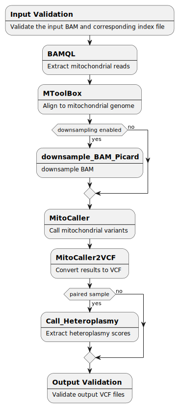

# Boutros Lab call-mtSNV pipeline

[](https://github.com/uclahs-cds/pipeline-call-mtSNV/actions/workflows/prepare-release.yaml)

- [Boutros Lab call-mtSNV pipeline](#boutros-lab-call-mtsnv-pipeline)
  - [Overview](#overview)
  - [How To Run](#how-to-run)
    - [Requirements](#requirements)
  - [Flow Diagram](#flow-diagram)
  - [Pipeline Steps](#pipeline-steps)
    - [1. Extract mtDNA](#1-extract-mtdna)
      - [a. BAM Processing BAMQL](#a-bam-processing-bamql)
      - [b. CRAM processing with SAMTools](#b-cram-processing-with-samtools)
    - [2. Align mtDNA with MToolBox](#2-align-mtdna-with-mtoolbox)
    - [3.\[Optional\] Downsample BAM](#3optional-downsample-bam)
    - [4. Call mtSNV with mitoCaller](#4-call-mtsnv-with-mitocaller)
    - [5. Convert mitoCaller output with Mito2VCF](#5-convert-mitocaller-output-with-mito2vcf)
    - [6. Call Heteroplasmy on Paired Samples](#6-call-heteroplasmy-on-paired-samples)
  - [Inputs](#inputs)
    - [input.yaml](#inputyaml)
      - [Single Mode](#single-mode)
      - [Paired Mode](#paired-mode)
    - [input.config](#inputconfig)
      - [Base resource allocation updaters](#base-resource-allocation-updaters)
  - [Outputs](#outputs)
    - [Primary outputs](#primary-outputs)
    - [Intermediate outputs](#intermediate-outputs)
  - [Testing and Validation](#testing-and-validation)
    - [Test Data Set](#test-data-set)
    - [Running Tests with NFTest](#running-tests-with-nftest)
    - [Validation Tool](#validation-tool)
  - [References](#references)
  - [Discussions](#discussions)
  - [Contributors](#contributors)
  - [Please see list of Contributors at GitHub.](#please-see-list-of-contributors-at-github)
  - [License](#license)

## Overview
This Nextflow pipeline takes either a single alignment file or paired normal-tumor alignment files in the BAM or CRAM format and extracts mitochondrial DNA reads, remaps the reads to a mitochondrial reference genome, and subsequently calls variants. Paired mode gives an additional heteroplasmy comparison.
___

## How To Run
> **Note**: Because this pipeline uses an image stored in the GitHub Container Registry, you must follow the steps listed in the [Docker Introduction](https://uclahs-cds.atlassian.net/wiki/spaces/BOUTROSLAB/pages/3190419/Docker+Introduction#DockerIntroduction-HowtosetupPATandlogintotheregistryHowtosetupPATandlogintotheregistry) on Confluence to set up a PAT for your GitHub account and log into the registry on the cluster before running this pipeline.

Samples can be run by specifying file locations in the [`input.yaml`](./input/template.yaml) and setting pipeline-specific parameters in the [`input.config`](./config/template.config).

### Requirements
Currently supported Nextflow versions: `v23.04.2`
___

## Flow Diagram

___
## Pipeline Steps

### 1. Extract mtDNA
#### a. BAM Processing BAMQL

[BAMQL](https://doi.org/10.1186/s12859-016-1162-y) is a package or query language published by the Boutros lab for extracting reads from BAM files.[<sup>1-2</sup>](#references)

#### b. CRAM processing with SAMTools

SAMTools is a suite of programs for interacting with high-throughput sequencing dat[<sup>3</sup>](#references). This pipeline uses the SAMTools View command to extract reads from CRAM files.

### 2. Align mtDNA with MToolBox


MToolBox is used to align the extracted mitochondrial reads. It can accept as input either raw data or prealigned reads.[<sup>4</sup>](#references) In both cases, reads are mapped by the mapExome.py script to a mitochondrial reference genome. The current pipeline uses the Reconstructed Sapiens Reference Sequence(RSRS).[<sup>5</sup>](#references) This generates a dataset of reliable mitochondrial aligned reads.

### 3.[Optional] Downsample BAM

To manage potential memory constraints when processing BAM files with a high volume of reads, our pipeline incorporates Picard's DownsampleSam tool. This utility reduces the dataset size by randomly selecting a subset of reads, thereby decreasing memory usage in subsequent analysis steps.[<sup>6</sup>](#references)

### 4. Call mtSNV with mitoCaller

While human diploid cells have two copies of each chromosome, human cells can have a varying quantity of mtDNA ranging from 100-10,000 copies.  The resultant high coverage in bulk sequencing data allows for the sensitive detection of low frequency variation seen with mitoCaller. [mitoCaller](https://doi.org/10.1371/journal.pgen.1005306) is a script which uses a mitochondrial specific algorithm designed to account for these unique factors to identify mtDNA variants.[<sup>7-8</sup>](#references)

### 5. Convert mitoCaller output with Mito2VCF

mitoCaller2VCF converts results from mitoCaller to VCF format as the output of mitoCaller is a TSV file and must be processed to increase legibility.[<sup>7</sup>](#references)

### 6. Call Heteroplasmy on Paired Samples

Heteroplasmy is the presence of more than one type of organellar genome (mitochondrial DNA or plastid DNA) within a cell or individual. This script compares heteroplasmy using the normal sample as a reference point.

## Inputs

### input.yaml
This input YAML must comply with the format in the provided [template](./input/input-call-mtSNV-paired.yaml).

| Field | Type | Description |
|:------|:-----|:----------------------------|
| patient_id | string | Name of patient. |
| normal_BAM | path | Absolute path to normal BAM file. |
| tumor_BAM | path | Absolute path to tumor BAM file. |

#### Single Mode

Provide either a normal sample or tumor sample and leave the other entry blank in the YAML. The data will be organized by the provided sample's ID.

#### Paired Mode

The data will be organized under the tumor sample ID.

### input.config
The config file can take 11 arguments. See provided [template](./config/template.config).
|| Input Parameter | Required | Type | Description |
|:---|:----------------|:---------|:-----|:----------------------------|
| 1 | `dataset_id` | yes | string | dataset identifier attached to pipeline output. |
| 2 | `output_dir` | yes | path | Absolute path to location of output. |
| 3 | `mt_ref_genome_dir` | yes | path | Absolute path to directory containing mitochondrial ref genome and mt ref genome index files. Path: `/hot/resource/mitochondria_ref/genome_fasta`|
| 4 | `gmapdb` | yes | path | Absolute path to to gmapdb directory. Path: `/hot/resource/mitochondria_ref/gmapdb/gmapdb_2021-03-08` |
| 5 | `save_intermediate_files` | no | boolean | Save intermediate files. If yes, not only the final BAM, but also the unmerged, unsorted, and duplicates unmarked BAM files will also be saved. Default is set to `false`. |
| 6 | `cache_intermediate_pipeline_steps` | no | boolean | Enable caching to resume pipeline and the end of the last successful process completion when a pipeline fails (if true the default submission script must be modified). Default is set to `false`. |
| 7 | `base_resource_update` | no | namespace | Namespace of parameters to update base resource allocations in the pipeline. Usage and structure are detailed in `template.config` and below. |
| 8 | `downsample_mtoolbox_bam` | no | boolean |  |
| 9 | `probability_downsample` | no | float | Corresponds to the PROBABILITY parameter in DownsampleSam. Specifies the fraction of reads to retain during downsampling. |
| 10 |`downsample_strategy`  | no | string | Corresponds to the STRATEGY parameter in DownsampleSam. Determines the algorithm used for downsampling. Options include ConstantMemory, HighAccuracy, and Chained. |
| 11 |`downsample_accuracy`  | no | string | Corresponds to the ACCURACY parameter in DownsampleSam. Defines the desired accuracy level for the downsampling process. A smaller value indicates higher accuracy but may require more memory. |

Additionally, There are 3 parameters which are defined in a [default config](./config/default.config) but can be optionally included and overwritten in the `input.config`.

|| Parameter | Type | Default | Description |
|:---|:----------------|:-----|:-----|:----------------------------|
| 1 | downsample_seed | int | 1 | Random seed used for downsample process |
| 2 | downsample_index | boolean | true | Whether to create a BAM index of downsample |
| 3 | downsample_validation_stringency | string | 'LENIENT' | Corresponds to the VALIDATION_STRINGENCY paramter of DownsampleSam. Choices: STRICT, LENIENT, SILENT|

 #### Base resource allocation updaters
To optionally update the base resource (cpus or memory) allocations for processes, use the following structure and add the necessary parts. The default allocations can be found in the [node-specific config files](./config/)

```Nextflow
base_resource_update {
    memory = [
        [['process_name', 'process_name2'], <multiplier for resource>],
        [['process_name3', 'process_name4'], <different multiplier for resource>]
    ]
    cpus = [
        [['process_name', 'process_name2'], <multiplier for resource>],
        [['process_name3', 'process_name4'], <different multiplier for resource>]
    ]
}
```
> **Note** Resource updates will be applied in the order they're provided so if a process is included twice in the memory list, it will be updated twice in the order it's given.

Examples:

- To double memory of all processes:
```Nextflow
base_resource_update {
    memory = [
        [[], 2]
    ]
}
```
- To double memory for `convert_mitoCaller2vcf_mitoCaller` and triple memory for `Validate_Inputs` and `call_heteroplasmy `:
```Nextflow
base_resource_update {
    memory = [
        ['convert_mitoCaller2vcf_mitoCaller', 2],
        [['Validate_Inputs', 'call_heteroplasmy'], 3]
    ]
}
```
- To double CPUs and memory for `convert_mitoCaller2vcf_mitoCaller` and double memory for `Validate_Inputs`:
```Nextflow
base_resource_update {
    cpus = [
        ['convert_mitoCaller2vcf_mitoCaller', 2]
    ]
    memory = [
        [['convert_mitoCaller2vcf_mitoCaller', 'Validate_Inputs'], 2]
    ]
}
```

## Outputs

> **Note:** All primary alignment (BAM) and variant call (VCF) outputs are indexed, with checksums generated for both the outputs and their index files

### Primary outputs
|Process| Output | Description |
|:------|:--------|:----------------|
|align_mtDNA_MToolBox|`*.bam`| Aligned, sorted, mitochondrial reads in BAM format|
|align_mtDNA_MToolBox|`*mt-classification-best-results.csv`| Contains the best haplogroup prediction for each sequence |
|align_mtDNA_MToolBox|`*prioritized_variants.txt`| Contains annotation only for prioritized variants for each sample analyzed, sorted by increasing nucleotide variability |
|align_mtDNA_MToolBox|`*summary.txt`| Summary of selected options. Includes predicted haplogroups, total and prioritized variants, coverage of reconstructed genomes, count of homoplasmic and heteroplasmic variants|
|convert_mitoCaller2VCF|`*.vcf.gz`| MitoCaller variant calls in VCF format |
|call_heteroplasmy|`*.tsv`| [Paired mode only] A tsv table showing differences in the normal genotype vs tumor genotype. It also gives heteroplasmy_fraction if there is any|
|call_heteroplasmy|`*.tsv.*`| [Paired mode only] Checksum for generated tsv file |


### Intermediate outputs
|Process| Output | Description |
|:------|:--------|:----------------|
|extract_mtDNA_BAMQL|`*.bam`| [bam input only] Outputs BAM file with only mitochondrial reads |
|extract_mtDNA_SAMtools|`*.bam`| [cram input only] Outputs BAM file with only mitochondrial reads |
|align_mtDNA_MToolBox| `OUT_*/`| This folder contains additional intermediate files. Description of the contents can be found [here](https://github.com/mitoNGS/MToolBox/wiki/Output-files) |
|align_mtDNA_MToolBox | `*logassemble.txt` | The log file of the assembleMTgenome.py script |
|align_mtDNA_MToolBox | `*processed-fastq.tar.gz` | Compressed FASTQ files generated from BAM input files |
|align_mtDNA_MToolBox | `*.conf` | Configuration file listing parameters used in an MToolBox run  |
|align_mtDNA_MToolBox | `*sample.vcf` | Contains mitochondrial variant positions against reference genome |
|call_mtSNV_mitoCaller | `*.tsv` | Contains mtDNA variants (i.e., homoplasmies and heteroplasmies)|
|call_heteroplasmy | `*unfiltered.tsv` |  [Paired mode] Unfiltered tsv table showing differences in the normal genotype vs tumor genotype. |
|call_heteroplasmy | `*.pl.programinfo` | [Paired mode] The log file generated for the heteroplasmy call process |
___

## Testing and Validation

### Test Data Set

Both WGS and WES aligned BAM files were used to test in single and tumor-normal paired modes.

|| Type | Mode | Size | CPU threads |PeakVMemory | Run Time |
|:--|:---|:----|:-----|:-----|:------|:------|
|1|WES|Single|4GB|72 | 9.381 GB | ~4 min|
|2|WES|Paired|4GB/4GB|72 | 12.317 GB |~8 min |
|3|WGS|Single|399GB|72 | 21.042 GB | ~2h 40 min|
|4|WGS|Paired|399GB/740GB|72 | 26.615 GB | ~5 hours|

### Running Tests with NFTest

Ensure NFTest is installed on your system. If it is not installed follow installation instructions in the [NFTest documentation](https://github.com/uclahs-cds/tool-NFTest).

To test annotators run the command with the annotator of interest:
```
nftest run [test-paired-01 test-single-normal-01 test-single-tumor-01 test-paired-10 test-single-normal-10 test-single-tumor-10]
```

Additionally it is possible to modify the `nftest.yml` file to tune testing.
All testing assets can be found in the `test/` directory.

For larger jobs a [cluster submission tool](https://github.com/uclahs-cds/tool-submit-nf) is available for NFTest.

### Validation Tool

Included is a template for validating your input files. For more information on the tool check out: https://github.com/uclahs-cds/tool-validate-nf

---

## References
1. [Masella, A.P., Lalansingh, C.M., Sivasundaram, P. et al. BAMQL: a query language for extracting reads from BAM files. BMC Bioinformatics 17, 305 (2016)](https://doi.org/10.1186/s12859-016-1162-y)
2. [BAMQL github](https://github.com/BoutrosLaboratory/bamql/releases/tag/v1.6)
3.  [SAMTools](https://www.htslib.org/)
4.  [Calabrese C, Simone D, Diroma MA, et al. MToolBox: a highly automated pipeline for heteroplasmy annotation and prioritization analysis of human mitochondrial variants in high-throughput sequencing. Bioinformatics. 2014;30(21):3115-3117](https://pubmed.ncbi.nlm.nih.gov/25028726/)
5.  [MToolBox github](https://github.com/mitoNGS/MToolBox)
6.  [DownsampleSAM](https://gatk.broadinstitute.org/hc/en-us/articles/360037056792-DownsampleSam-Picard)
7.  [mitoCaller](https://lgsun.irp.nia.nih.gov/hsgu/software/mitoAnalyzer/mitoAnalyzer.htm)
8.  [Ding J, Sidore C, Butler TJ, Wing MK, Qian Y, et al. (2015) Correction: Assessing Mitochondrial DNA Variation and Copy Number in Lymphocytes of ~2,000 Sardinians Using Tailored Sequencing Analysis Tools](https://doi.org/10.1371/journal.pgen.1005306)

---

## Discussions
- [Issue tracker](https://github.com/uclahs-cds/pipeline-call-mtSNV/issues) to report errors and enhancement ideas.
- Discussions can take place in [<pipeline> Discussions](https://github.com/uclahs-cds/pipeline-call-mtSNV/discussions)
- [<pipeline> pull requests](https://github.com/uclahs-cds/pipeline-call-mtSNV/pulls) are also open for discussion

---

## Contributors
Please see list of [Contributors](https://github.com/uclahs-cds/pipeline-call-mtSNV/graphs/contributors) at GitHub.
---

## License

Author: Alfredo Gonzalez (alfgonzalez@mednet.ucla.edu), Takafumi Yamaguchi (tyamaguchi@mednet.ucla.edu), Jieun Oh (jieunoh@mednet.ucla.edu), Kiarod Pashminehazar (kpashminehazar@mednet.ucla.edu)

Call-mtSNV is licensed under the GNU General Public License version 2. See the file LICENSE for the terms of the GNU GPL license.

Call-mtSNV takes a single aligned BAM or pair of normal tumor BAMs and does variant calling for mtDNA.

Copyright (C) 2021-2025 University of California Los Angeles ("Boutros Lab") All rights reserved.

This program is free software; you can redistribute it and/or modify it under the terms of the GNU General Public License as published by the Free Software Foundation; either version 2 of the License, or (at your option) any later version.

This program is distributed in the hope that it will be useful, but WITHOUT ANY WARRANTY; without even the implied warranty of MERCHANTABILITY or FITNESS FOR A PARTICULAR PURPOSE. See the GNU General Public License for more details.
